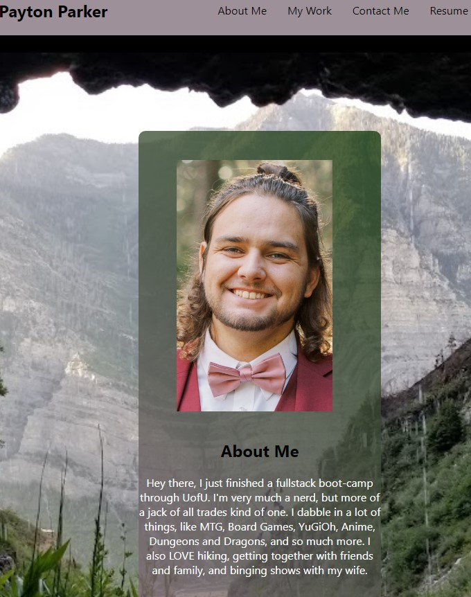

  # Payton Parker React Portfolio
  ## Table of Contents
  - [Table of Contents](#table-of-contents)
  - [Deployment](#deployment)
  - [License](#license)
  - [Description](#description)
  - [Screenshot](#screenshot)
  - [Contact](#contact)
  
  ## License
  
  ## Deployment
  https://ikomeda.github.io/PaytonPortfolio/
  ## Description
  This is my portfolio that I made with React to showcase my abilities with coding, as well as to have a place to easily contact me and view some of my projects.
  ## Screenshot
  
  ## Contact
  * GitHub: https://github.com/Ikomeda/
  * Email: rekrapnotyap@gmail.com
